# Gallery

> Auto-generated by `build_gallery.py` from the style packs — don't edit by hand.

> Each style ships one reproducible prompt formula. Add your own: copy `styles/_template/` and open a PR (see CONTRIBUTING).

## 3D craft

### Cream Clay 3D

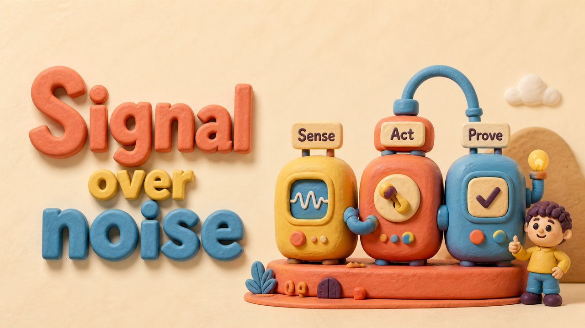

Medium **3D craft** · [pack & prompt formula →](styles/clay-3d/STYLE.md)

## African textile

### Bogolan Mudcloth

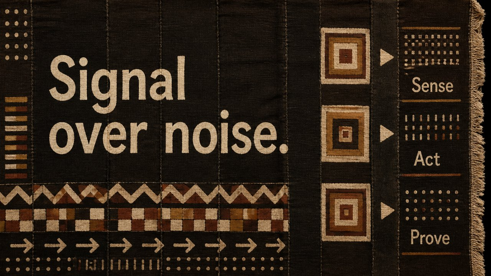

Medium **African textile** · [pack & prompt formula →](styles/bogolanfini-mudcloth/STYLE.md)

### Kente Cloth

Medium **African textile** · [pack & prompt formula →](styles/kente-cloth/STYLE.md)

## Astronomical

### Celestial Gold

Medium **Astronomical** · [pack & prompt formula →](styles/celestial-gold/STYLE.md)

## Bookbinding

### Gilt Leather

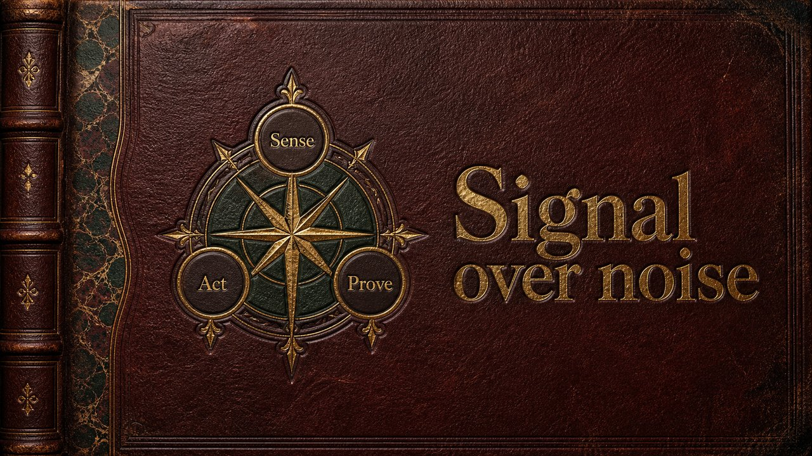

Medium **Bookbinding** · [pack & prompt formula →](styles/leather-gilt/STYLE.md)

## Carving

### Stone Relief

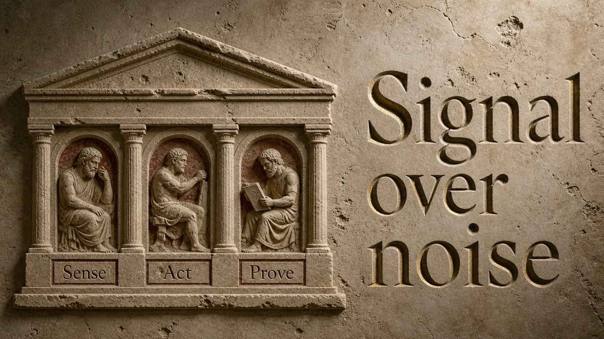

Medium **Carving** · [pack & prompt formula →](styles/stone-relief/STYLE.md)

## Ceramic

### Blue & White Porcelain

Medium **Ceramic** · [pack & prompt formula →](styles/blue-white-porcelain/STYLE.md)

### Kintsugi

Medium **Ceramic** · [pack & prompt formula →](styles/kintsugi/STYLE.md)

### Porcelain & Indigo

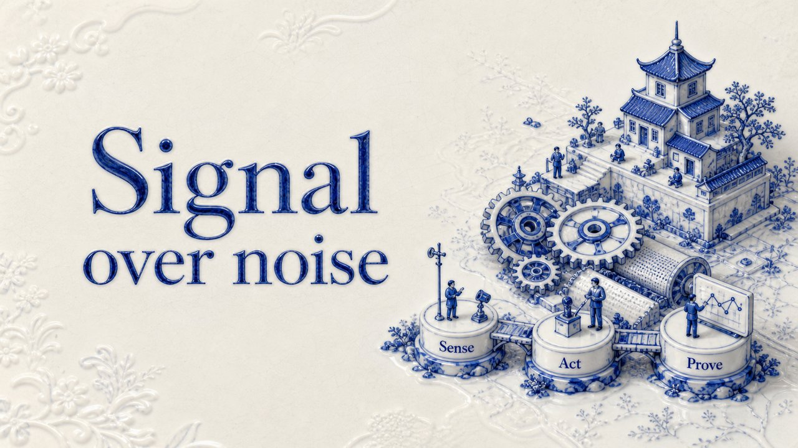

Medium **Ceramic** · [pack & prompt formula →](styles/porcelain-indigo/STYLE.md)

## Chinese ink

### Ink Wash

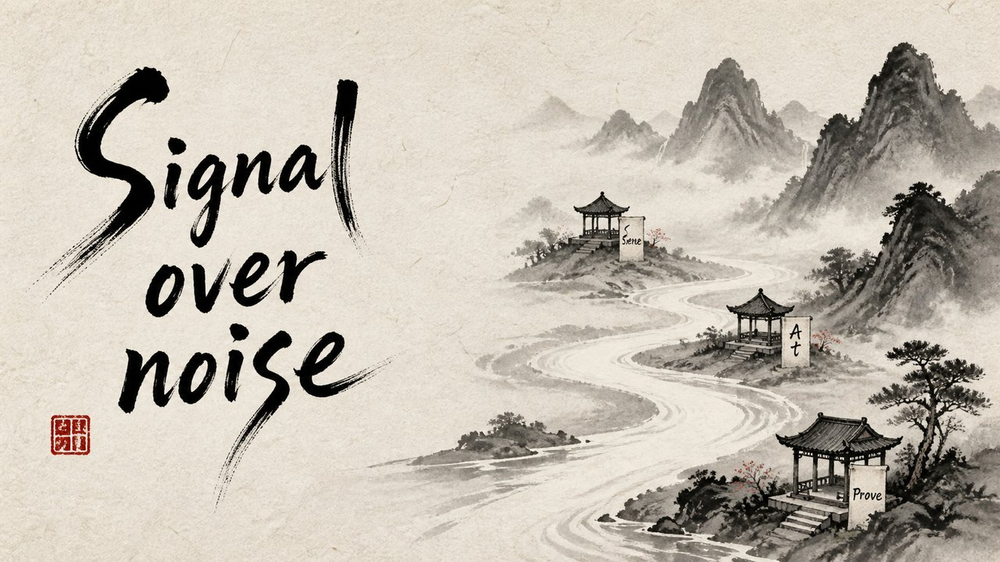

Medium **Chinese ink** · [pack & prompt formula →](styles/ink-wash/STYLE.md)

## Cinema

### Sodium-Green Noir

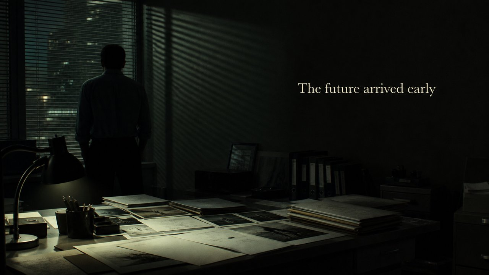

Medium **Cinema** · [pack & prompt formula →](styles/cinema-fincher/STYLE.md)

### Suspense Staircase

Medium **Cinema** · [pack & prompt formula →](styles/cinema-hitchcock/STYLE.md)

### Quiet Realism

Medium **Cinema** · [pack & prompt formula →](styles/cinema-hou-koreeda/STYLE.md)

### One-Point Cold

Medium **Cinema** · [pack & prompt formula →](styles/cinema-kubrick/STYLE.md)

### Wind & Motion

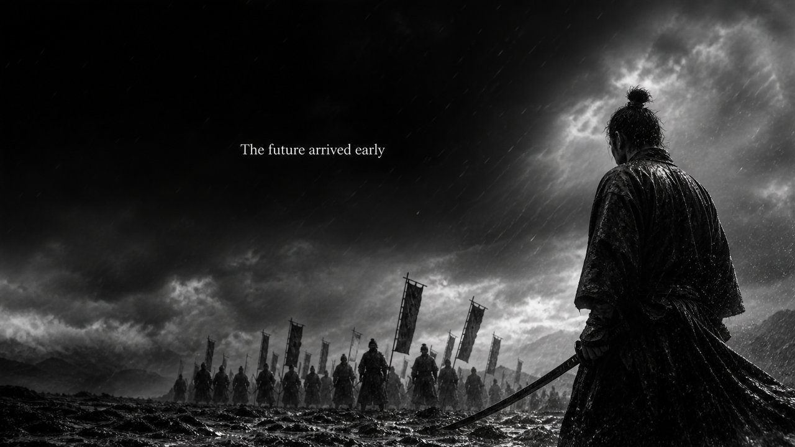

Medium **Cinema** · [pack & prompt formula →](styles/cinema-kurosawa/STYLE.md)

### Cold Monument

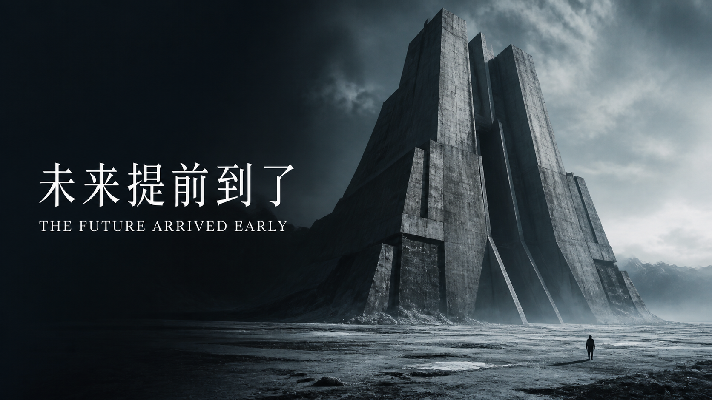

Medium **Cinema** · [pack & prompt formula →](styles/cinema-nolan/STYLE.md)

### Misty Poetic

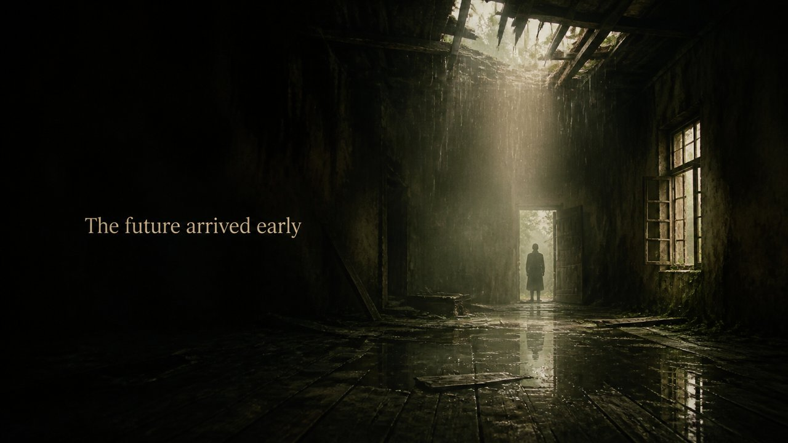

Medium **Cinema** · [pack & prompt formula →](styles/cinema-tarkovsky/STYLE.md)

### Warm Monolith

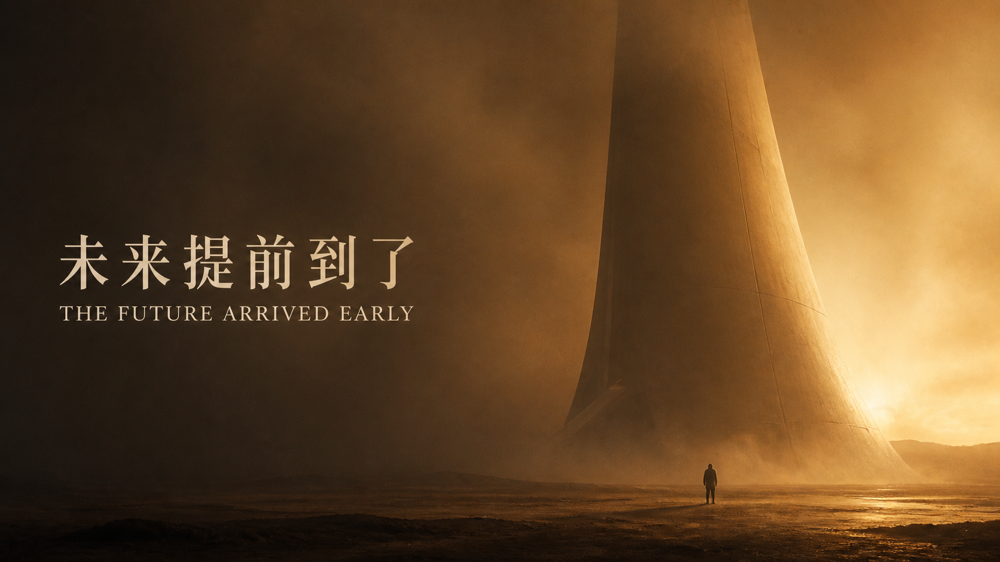

Medium **Cinema** · [pack & prompt formula →](styles/cinema-villeneuve/STYLE.md)

### Symmetric Pastel

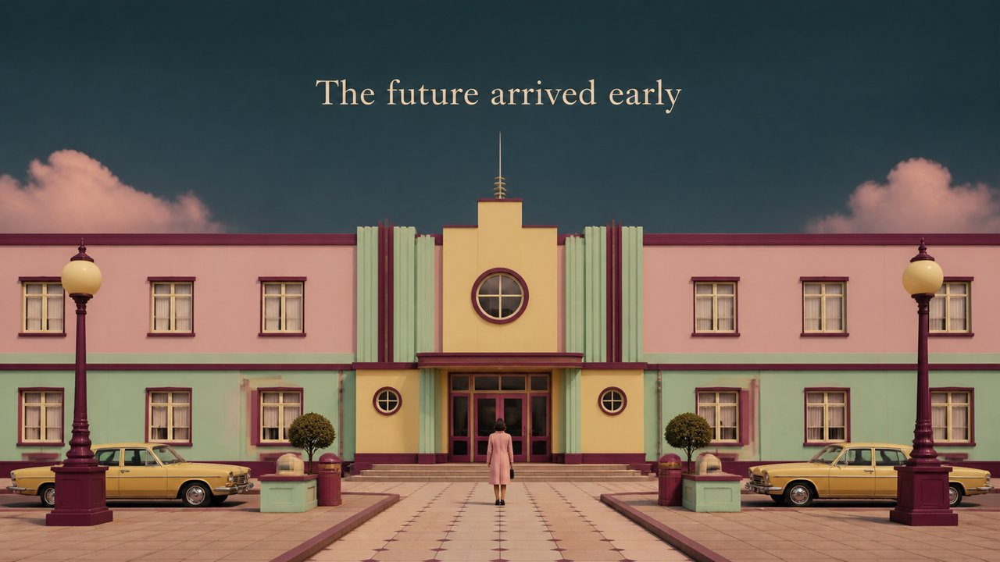

Medium **Cinema** · [pack & prompt formula →](styles/cinema-wesanderson/STYLE.md)

### Neon Nocturne

Medium **Cinema** · [pack & prompt formula →](styles/cinema-wongkarwai/STYLE.md)

### Massed Color

Medium **Cinema** · [pack & prompt formula →](styles/cinema-zhangyimou/STYLE.md)

## Da Vinci copperplate

### Da Vinci Copperplate

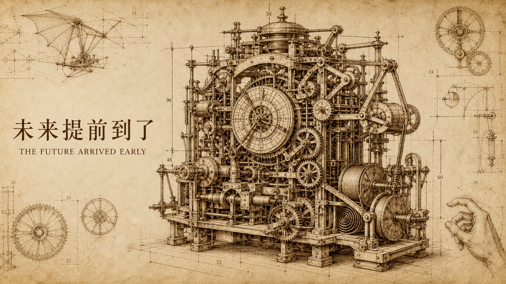

Medium **Da Vinci copperplate** · [pack & prompt formula →](styles/davinci-copperplate/STYLE.md)

## Deco

### Art Deco Black & Gold

Medium **Deco** · [pack & prompt formula →](styles/artdeco-gold/STYLE.md)

## Diagram

### Retro Science Cutaway

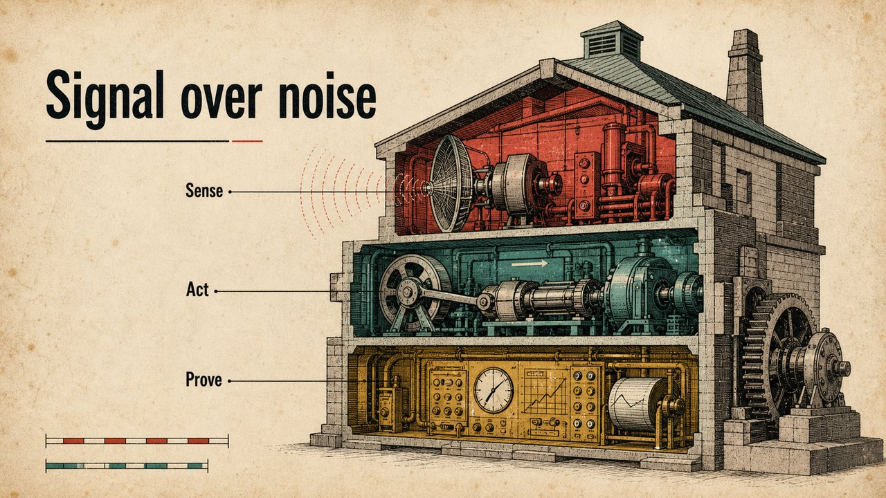

Medium **Diagram** · [pack & prompt formula →](styles/retro-science-cutaway/STYLE.md)

## Enamel

### Cloisonné

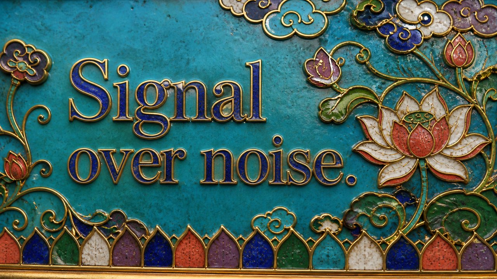

Medium **Enamel** · [pack & prompt formula →](styles/cloisonne/STYLE.md)

## Fresco

### Dunhuang Mural

Medium **Fresco** · [pack & prompt formula →](styles/dunhuang-mural/STYLE.md)

## Hand-drawn

### Warm Pencil Sketch

Medium **Hand-drawn** · [pack & prompt formula →](styles/warm-sepia/STYLE.md)

## Industrial

### Enamel Signage

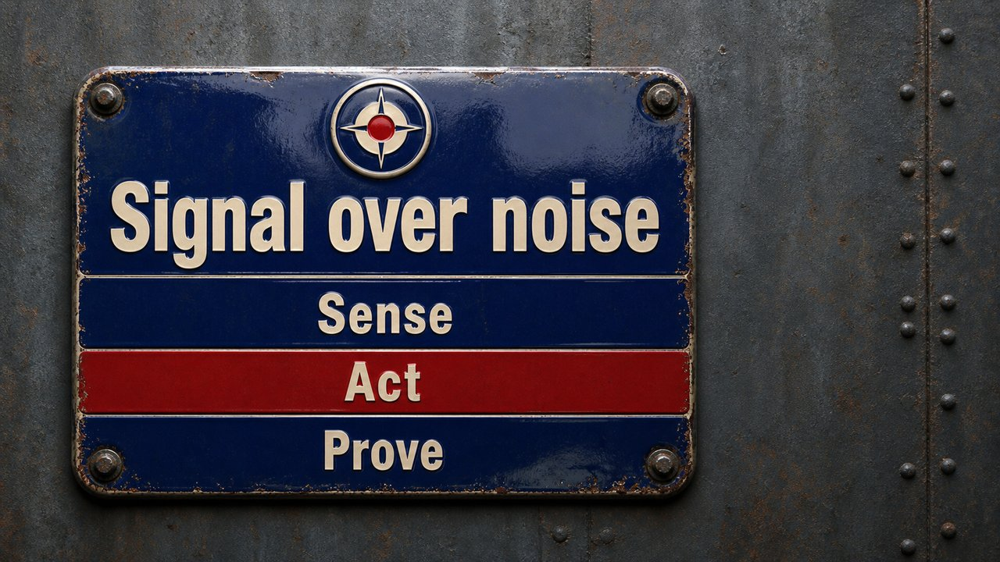

Medium **Industrial** · [pack & prompt formula →](styles/enamel-signage/STYLE.md)

## Ink rubbing

### Stele Rubbing

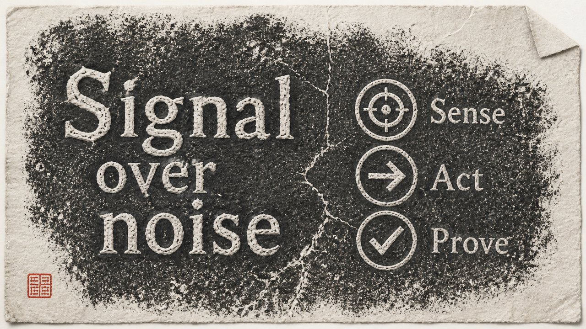

Medium **Ink rubbing** · [pack & prompt formula →](styles/stele-rubbing/STYLE.md)

## Islamic tile

### Zellige Girih

Medium **Islamic tile** · [pack & prompt formula →](styles/zellige-girih/STYLE.md)

## Lacquer

### Lacquer & Mother-of-Pearl

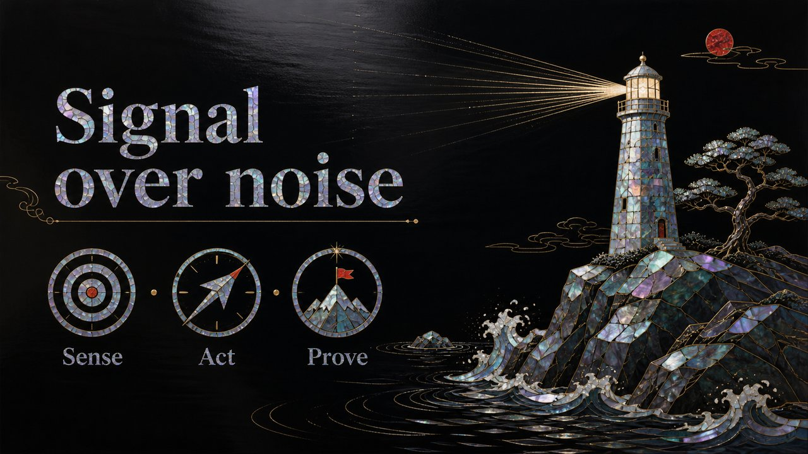

Medium **Lacquer** · [pack & prompt formula →](styles/lacquer-mop-inlay/STYLE.md)

## Manuscript

### Founding Charter

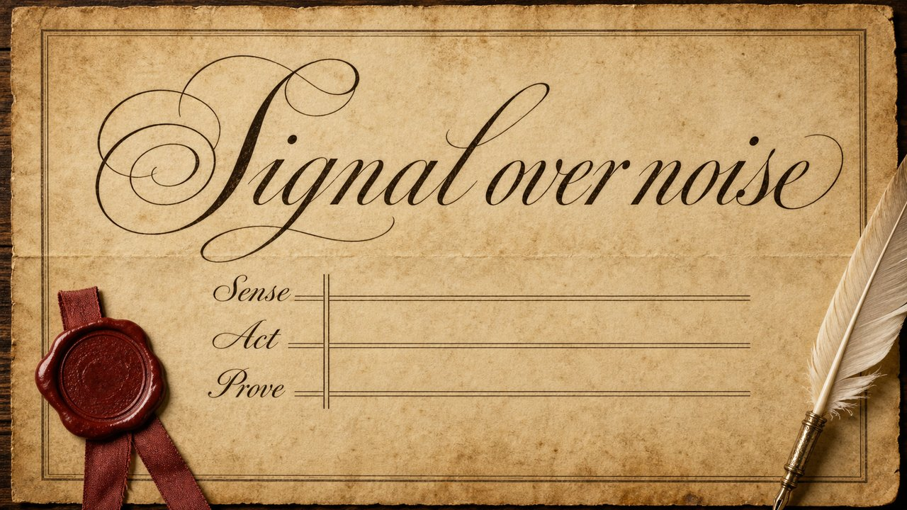

Medium **Manuscript** · [pack & prompt formula →](styles/founding-charter/STYLE.md)

## Modern

### Swiss Grid

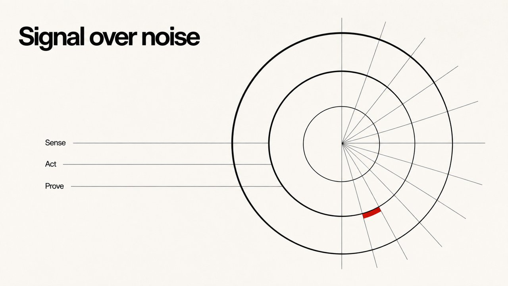

Medium **Modern** · [pack & prompt formula →](styles/swiss-grid/STYLE.md)

## Painterly

### Watercolor Editorial

Medium **Painterly** · [pack & prompt formula →](styles/watercolor-editorial/STYLE.md)

## Paper craft

### Paper Sculpture

Medium **Paper craft** · [pack & prompt formula →](styles/papercraft/STYLE.md)

## Portolan chart

### Portolan Sea Chart

Medium **Portolan chart** · [pack & prompt formula →](styles/portolan/STYLE.md)

## Print

### Letterpress Broadsheet

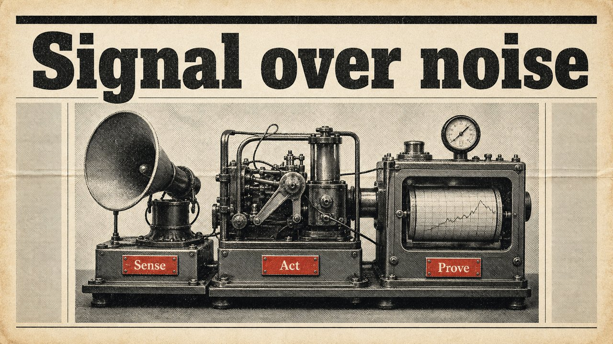

Medium **Print** · [pack & prompt formula →](styles/broadsheet-news/STYLE.md)

### Cyanotype

Medium **Print** · [pack & prompt formula →](styles/cyanotype-botanical/STYLE.md)

### Screenprint Poster

Medium **Print** · [pack & prompt formula →](styles/screenprint-poster/STYLE.md)

## Technical

### Cyan Blueprint

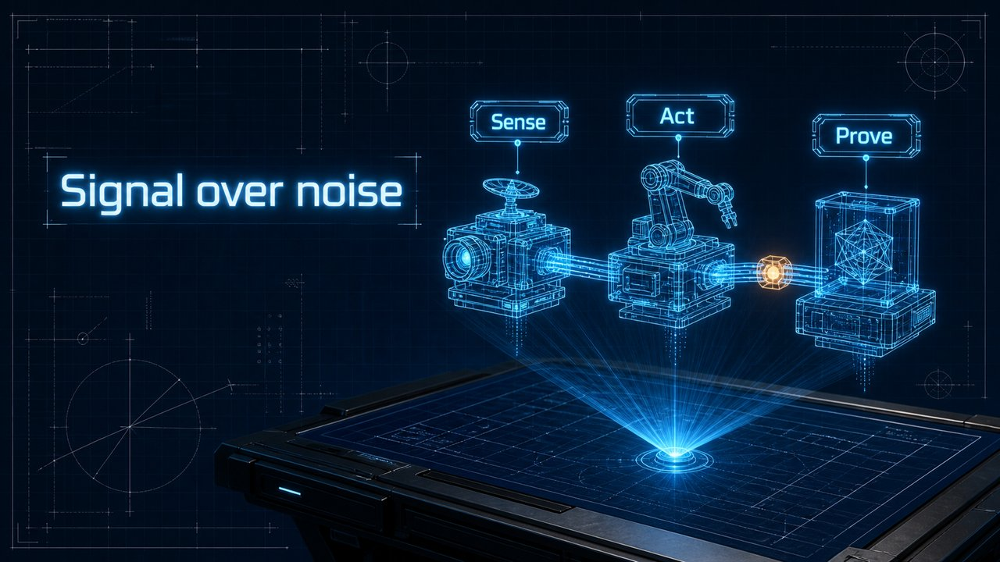

Medium **Technical** · [pack & prompt formula →](styles/cyber-blueprint/STYLE.md)

## Textile

### Batik Wax-Resist

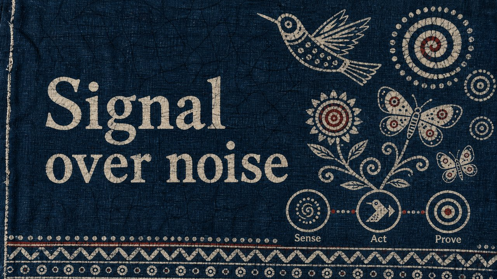

Medium **Textile** · [pack & prompt formula →](styles/batik-waxresist/STYLE.md)

### Linen Embroidery

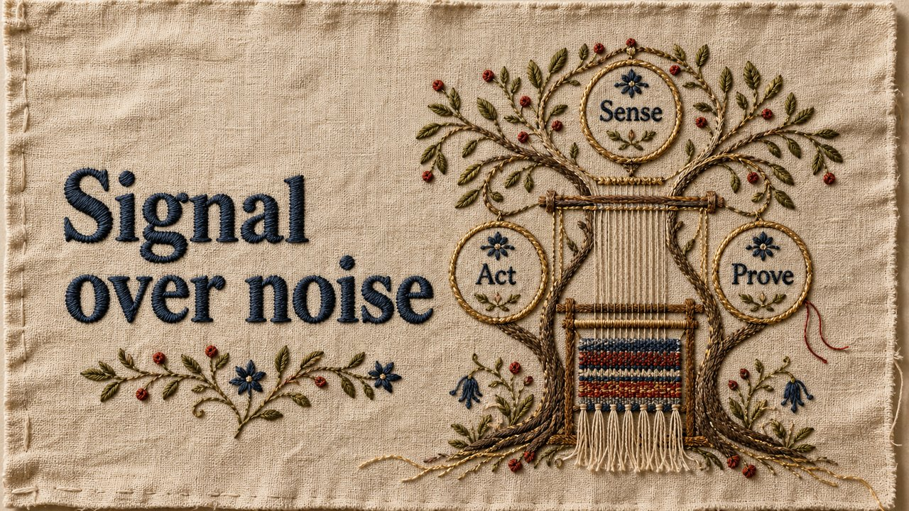

Medium **Textile** · [pack & prompt formula →](styles/embroidery-tapestry/STYLE.md)

### Kesi Silk Tapestry

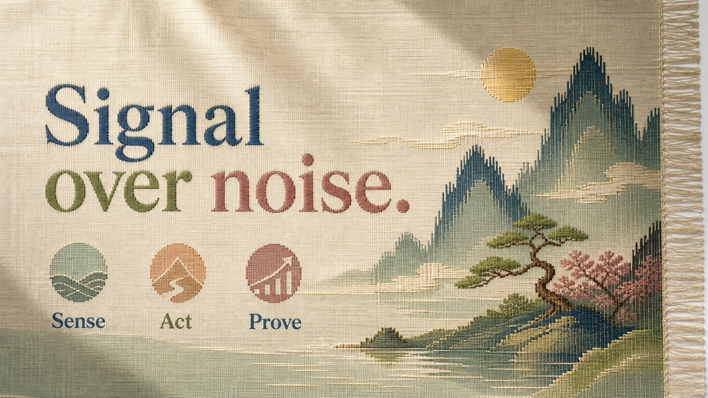

Medium **Textile** · [pack & prompt formula →](styles/kesi-tapestry/STYLE.md)

### Shu Brocade

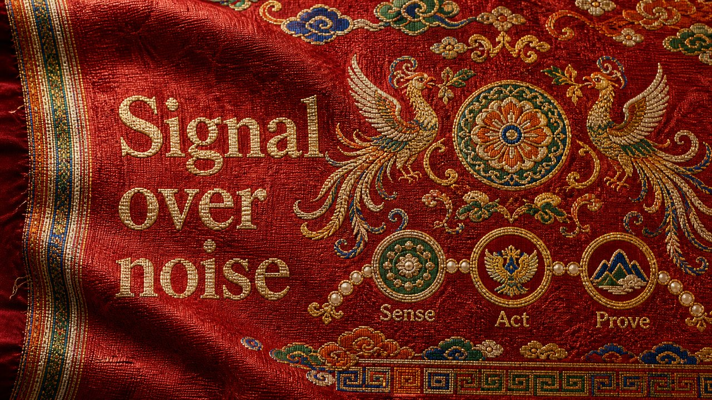

Medium **Textile** · [pack & prompt formula →](styles/shu-brocade/STYLE.md)

## Woodblock

### Ukiyo-e Woodblock

Medium **Woodblock** · [pack & prompt formula →](styles/ukiyoe-woodblock/STYLE.md)

