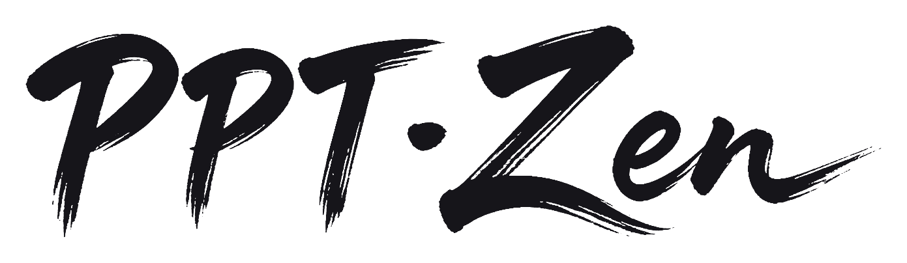

<p align="center"><b>English</b> · <a href="README.zh-CN.md">简体中文</a></p>

<p align="center"><picture><source media="(prefers-color-scheme: dark)" srcset="assets/logo-wordmark-dark.png"></picture></p>

<p align="center"><b>One sentence in — a cinematic, full-image deck out.</b></p>

<p align="center">
  <a href="LICENSE"></a>
  <a href="LICENSE-STYLES"></a>
  <a href="https://github.com/rocsgh/ppt-zen/stargazers"></a>
</p>

<p align="center"><b>🖼 <a href="https://pptzen.xyz">Live gallery →</a></b></p>

<p align="center">
  
  
  
</p>

<p align="center"><i>The same sentence — "make me a deck." Three materials, three worlds.<br/>These three frames are real output, untouched.</i></p>

---

## What it is

PPT-Zen is a **deck-making skill** you install into your AI assistant (Claude Code, Cursor, Codex — seven runtimes supported). Once it's in, you say one sentence:

> "Make me a 10-page deck about ⟨your project⟩ with ppt-zen, in the sea-chart style."

What comes back is not "a template with text boxes." It's ten slides, each **painted as one complete picture** — title, data, illustration and paper grain living in the same image. It reads like a film still or a printed spread, not like office software.

And in between, **you answer zero questions**: no template picker, no color questionnaire, no "what goes on each slide?". How much each page holds, how it's composed, what it draws — the skill decides all of it (how, exactly, is below under "It thinks").

## Why the output looks this good

**1. Whole pages are painted, not templated.**
Mainstream AI PPT tools pick a template and pour text into boxes — the bones are still office software, and it shows. PPT-Zen has a text-capable image model paint each page **in one pass**: background texture, typography, illustration and ruled borders are organic parts of a single artwork, with light and grain running through the whole frame. It's the difference between "a designer painted this page" and "software laid it out."

**2. 45 material worlds — and the whole deck holds one of them.**
The vellum and mineral watercolor of an old sea chart, the iron-gall ink of a da Vinci folio, the cold light of a Nolan frame, the wet-and-dry breath of ink wash, the wax seals and flourished script of an 18th-century founding charter… pick any of the 45 in the [gallery](https://pptzen.xyz). The material is **chosen once per deck** — from cover to closing page it stays one world, so ten pages read as one work instead of ten drifting images.

**3. Text that is actually readable — no pseudo-glyphs.**
The classic failure of full-image slides is garbled text. PPT-Zen relies on text-capable image models (the gpt-image class), pins the exact characters of every string in the prompt, then **QCs every frame and proofreads every title character by character** — invented glyphs get the page regenerated. A brush-script CJK title on parchment comes out as real calligraphy, not pixel soup.

**4. Every page carries a drawn argument.**
Fairness gets a balance scale; an automated pipeline gets a geared machine; "asking once is pure luck" gets ink dots scattering and converging into a line. The illustration is not decoration — it's **the page's argument, drawn as a visible thing**: you can guess what the page says just by looking at it. No template will ever give you this layer.

## It thinks: every page is its own decision

You fill in no forms because these calls are made for you — **page by page**:

| What it decides | How |
|---|---|
| **How much this page holds** | Sayable in a line → big type and breathing room; only holds up side by side (comparisons, lists, evidence) → laid out dense and scannable |
| **How it's composed** | Auto-assigned by page role: chapter pull-quote → light-band; evidence grid → grid; cover → flowline… |
| **What it draws** | The page's argument translated into one object — the hardest and most valuable call |
| **What material the deck wears** | Yours if you name one; otherwise it picks — then locks it for the whole deck |

A real judgment chain looks like this:

```
Page = a chapter pull-quote → sayable in a line → HEADLINE → skeleton: light-band → device: the word itself is the picture
Page = competitive evidence → only holds up side by side → DETAIL → skeleton: grid → device: small checks and crosses replacing verdict sentences
       → and the previous page was dense, so the next one automatically breathes
```

None of these rules were invented at a desk — they were ground out of dozens of real decks (a 70-page keynote, a 57-page product analysis, a 10-page equity charter), and every rule answers a mistake we actually made. The full architecture — including the models we overturned along the way — lives in **[DESIGN.md](DESIGN.md)**.

## From one sentence to a finished deck

1. **Page plan** — it first writes `slides/PLAN.md`: one stanza per page with density, skeleton, device, the verbatim text and the full image prompt. This is its judgment log; you can edit it before any image is made;
2. **Material lock** — your named style (or its pick) becomes the prompt formula for the whole deck;
3. **Page-by-page generation** — one self-contained full-page prompt per slide, painted as a 16:9 image;
4. **QC** — every frame inspected; pseudo-glyphs, typos and broken compositions get a single-page redo (~2 min per page, never the whole deck);
5. **Assembly** — `assemble_pptx.py` stitches the images into a presentation-ready `deck.pptx`.

> **Said honestly: a tool, not a wishing well.** Frame-by-frame QC and character-level proofreading are **where the quality comes from** — we write them into the process instead of promising one-click zero-defect magic.

## What you get

- `slides/01.jpg … NN.jpg` — one full-image, 16:9 slide per page
- `slides/PLAN.md` — the page plan: what each page is and why
- `deck.pptx` — the assembled deck; PDF / Keynote / Google Slides import the same full-bleed images

It is **not** a hosted button — it's a skill your agent runs plus two small scripts, so it rides on your own models and keys, engine-agnostic.

Want to see one before you install anything? The finished `deck.pptx` and all ten JPGs ship in [`examples/`](examples/) — clone the repo and open them, no key needed.

## Quick start

```bash
git clone https://github.com/rocsgh/ppt-zen
cd ppt-zen

# 1. install the skill for YOUR runtime (matrix below)
./install.sh                          # report which runtimes are on this machine
./install.sh auto                     # install into every runtime detected
./install.sh claude --global          # or name one: Claude Code -> ~/.claude/skills/ppt-zen/

# 2. give it an image model (skip if your agent already generates images — e.g. Hermes)
cp .env.example .env                  # put your key in .env
python3 scripts/gen_image.py --check  # doctor: config + one test image, before a long run

# 3. in your agent, one sentence:
#    "Make me a 10-page pitch deck about <your project> with ppt-zen, in the Portolan style."
#    -> it plans the pages (slides/PLAN.md), then generates one image per page into slides/

# 4. assemble into an image-based .pptx (non-16:9 images are center cover-cropped)
pip install python-pptx
python3 scripts/assemble_pptx.py slides/ deck.pptx
```

### Install matrix — pick your runtime

Not sure what you have? `./install.sh` with no argument probes this machine (binary on `PATH`,
`~/.<runtime>/`, or a project marker like `./.claude/`) and prints where PPT-Zen would go for each
runtime it finds; `./install.sh auto` then installs into all of them — a project marker wins over
the global location, and Cursor/Windsurf/Copilot are skipped unless their project dir exists.

| Runtime | Command | Installs to | Trigger |
|---|---|---|---|
| **Claude Code** | `./install.sh claude [--global]` | `.claude/skills/ppt-zen/` | `/ppt-zen`, or just ask for a deck |
| **OpenClaw** | `./install.sh openclaw [--global]` | `.openclaw/skills/ppt-zen/` | ask for a deck |
| **Hermes** | `./install.sh hermes` | `~/.hermes/skills/creative/ppt-zen/` (or `$HERMES_HOME`) | ask for a deck |
| **Codex CLI** | `./install.sh codex [--global]` | `AGENTS.md` / `~/.codex/AGENTS.md` | passive — auto-read |
| **Cursor** | `./install.sh cursor` | `.cursor/rules/ppt-zen.mdc` | passive — auto-applied |
| **Windsurf** | `./install.sh windsurf` | `.windsurf/rules/ppt-zen.md` | passive — auto-applied |
| **GitHub Copilot** | `./install.sh copilot` | `.github/instructions/` | passive — auto-applied |
| everything | `./install.sh all` | all of the above | — |
| what you actually have | `./install.sh auto` | every runtime detected on this machine | — |

Skill installs are **self-contained** (SKILL.md + references + styles + scripts + examples +
`styles.json`, the machine-readable style index, + `requirements.txt`). `AGENTS.md` installs update in place between idempotent markers.
The full mapping lives in [`install/targets.json`](install/targets.json); passive-runtime files are
generated from `AGENTS.md` by `scripts/gen_adapters.py`.

**Hermes note.** Hermes has no project-level skill directory — it only scans `$HERMES_HOME/skills`
(default `~/.hermes/skills`) plus `skills.external_dirs`, so the `hermes` target always installs
there and `--global` is a no-op. **Restart your Hermes gateway/process after installing** — the
skill index is cached in-process and won't pick the skill up otherwise. Hermes' builtin
`powerpoint` skill (python-pptx text-box decks) keeps working alongside it; for designed
full-image decks ppt-zen supersedes it.

**No skill system at all?** Paste `SKILL.md` into the session as context.
**Dependencies:** the helpers are pure standard library; only `assemble_pptx.py` needs
`python-pptx` (which bundles Pillow — used for the 16:9 cover-crop).

## Image generation (bring your own model)

PPT-Zen ships **no image model** — that is what keeps it engine-agnostic. Which half applies to you:

| Your runtime | What you do |
|---|---|
| **Claude Code · Codex · Cursor · Windsurf · Copilot** | You need an image key — the 30-second `.env` setup below. |
| **Hermes** (or any agent with its own image tool) | Nothing to configure; the skill uses the tool the agent already has. |

**Bring your own key.** Copy `.env.example` to `.env` and fill it in — any **OpenAI-compatible images endpoint** works (OpenAI ``gpt-image``, a relay, or a compatible gateway; chat-only gateways don't count):

```
IMAGE_API_BASE_URL=https://api.openai.com/v1
IMAGE_API_KEY=sk-...
IMAGE_MODEL=gpt-image-1
```

Ready-to-paste blocks for OpenAI, generic relays and 火山方舟 / 豆包 Seedream: [`references/providers.md`](references/providers.md). Then:

```
python3 scripts/gen_image.py --check-config                 # doctor, config only — nothing sent
python3 scripts/gen_image.py --check                        # + a live probe: one billable test image
python3 scripts/gen_image.py "your full-page prompt" out.jpg
```

> A model that renders text well (gpt-image class) matters for readable titles — plain diffusion models garble text. ``.env`` is gitignored; never commit your key.

### Stuck at image generation?

`python3 scripts/gen_image.py --check` is the one command to run. It prints which `.env` it read, masks your key, generates one billable test image on your endpoint (it warns before doing so — `--check-config` stops short of the probe), and names the failure in plain language:

| Verdict | What it means |
|---|---|
| `no usable key` | `.env` is missing, or `IMAGE_API_KEY` still holds the `.env.example` placeholder. |
| `HTTP 401 / 403` | The key is wrong, expired, or has no image quota on that endpoint. |
| `HTTP 404 / 405`, or a non-JSON page | That base URL doesn't implement the images API — a chat-only gateway is the usual culprit. |
| `could not reach the endpoint` | Unreachable, slow or blocked: check `IMAGE_API_BASE_URL`, your network, any proxy. |

A long run no longer looks frozen: the helper prints `gen_image: requesting slides/03.jpg (attempt 1/3)` per page and retries 5xx/timeouts by itself (never a 4xx — that's config, and waiting won't fix it). Set `IMAGE_MAX_ATTEMPTS` to change the budget (default 3, clamped to 1–5). An interrupted run **resumes**: pages already present in `slides/` are skipped.

`--check` bills one image on your endpoint — it says so before probing. `python3 scripts/gen_image.py --check-config` gives the same config report with nothing sent, and `--help` lists every variable.

**No key — or don't want one today?** Ask for the deck anyway. You get the judgment pack instead of an error: `slides/PLAN.md` with every page's density, device, verbatim text and a complete ready-to-paste image prompt; placeholder pages; and an assembled `draft.pptx`. That pack is one command — the agent runs it for you, and you can run it yourself:

```bash
python3 scripts/judgment_pack.py --init 10 --style portolan   # -> slides/PLAN.md skeleton
python3 scripts/judgment_pack.py slides                       # -> placeholders + draft.pptx
```

Hand any prompt card to any image tool you already have (Midjourney, 即梦, Doubao…), drop the result into `slides/` over the matching placeholder, run the second command again — pages that already have an image are left alone. The key becomes an optional last step. A finished pack ships in [`examples/relayboard/slides/PLAN.md`](examples/relayboard/slides/PLAN.md).

## Start from a scenario

Don't know which of the 45 materials to name? Take the default for your situation and say the sentence:

| Scenario | Default material | What you say |
|---|---|---|
| Fundraise / pitch | Portolan Sea Chart | `"Make me a 10-page pitch deck about <project>, Portolan style."` |
| Consulting / quarterly review | Swiss Grid | `"Make me a 12-page Q3 review for <team>, Swiss Grid style."` |
| Internal share | Letterpress Broadsheet | `"Make me an 8-page internal share about <topic>, Letterpress Broadsheet style."` |

## Picking a style (the one thing you steer)

Once installed, just describe the deck in chat. **Every content-level call is automatic**; the one thing you steer is the **material / style**:

- **Let it pick.** Say nothing about looks; it chooses one coherent material for the whole deck.
- **Name a style.** Pick one from the [gallery](https://pptzen.xyz) and say its name:
  ```
  ...in the Portolan sea-chart style.
  ...cinema, Nolan hand.
  ...da Vinci copperplate.
  ```
- **Coarse or fine (medium -> hand -> world).** A medium ("make it cinematic"), a specific hand ("Villeneuve"), or a whole world — go as detailed as you like.

Rule of thumb: **material is chosen once for the whole deck** (a consistent look); the **device** — what each page *draws* — is decided page by page.

## Styles & Gallery

Browse every style — each with a reproducible prompt formula — in **[GALLERY.md](GALLERY.md)**. Add your own: copy `styles/_template/` and open a PR (see **[CONTRIBUTING](CONTRIBUTING.md)**). The gallery is auto-generated from the packs, so your contribution shows up automatically.

## Want it done for you?

The skill is free and self-serve. A hosted version that runs the full generate → QC → assemble pipeline for you is coming separately.

## Docs

| | |
|---|---|
| 🖼 [Live gallery](https://pptzen.xyz) | browse every style + its prompt formula |
| 🎨 [GALLERY.md](GALLERY.md) | the same gallery, in-repo |
| 🏗️ [DESIGN.md](DESIGN.md) | architecture, origin, and the models we overturned |
| 🤝 [CONTRIBUTING.md](CONTRIBUTING.md) | add your own style in one folder |
| 🔒 [BOUNDARY.md](BOUNDARY.md) | what's open vs. what stays private |

## License

- **Judgment layer** (SKILL, docs, code): **[Apache-2.0](LICENSE)**
- **Style packs & gallery content** (`styles/`, images): **[CC-BY-4.0](LICENSE-STYLES)**, contributions via DCO

What's in the open vs private: **[BOUNDARY.md](BOUNDARY.md)**.

## Inspired by

The design discipline is **inspired by** Garr Reynolds' *Presentation Zen*. This project is **unofficial and unaffiliated** with the author or publisher; all prose is our own.
