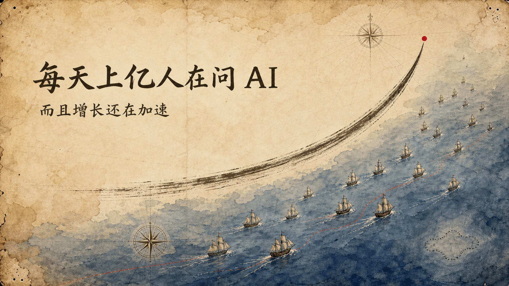

<h1 align="center">PPT-Zen</h1>

<p align="center"><b>A judgment layer for AI-made slides — not another PPT generator.</b><br/>
<b>一层让 AI 做幻灯片时"知道该怎么决定"的判断——不是又一个 PPT 生成器。</b></p>

<p align="center">
  
  
  
</p>

<p align="center"><i>One sentence in — "make me a deck." Judged page by page, generated full-image. Same line "未来提前到了", three worlds.<br/>
一句话进——「做个 PPT」。逐页判断、整页出图。同一句话，三个世界。</i></p>

---

**Two things this project is about:**
1. **A thinking AI** that decides *how* each page should be — you don't answer questions.
2. **Output that actually looks good** — full-image, designed, text that isn't garbled. (See the strip above; more in the [Gallery](GALLERY.md).)

**这个项目讲两件事：** ① 一个**会思考**的 AI，自己决定每页该怎么做；② **效果真的好**——整页设计、中文不糊（上面三张，更多看[画廊](GALLERY.md)）。

## What it is · 这是什么

Every AI PPT tool solves the same problem: *how to turn content into pages.* PPT-Zen open-sources the part nobody else does:

> **This page — how much should it hold, what should it look like, and on what grounds is it decided that way?**

市面上所有 AI PPT 工具都在解决"**怎么把内容变成页面**"。PPT-Zen 开源的是没人做的那层：**这一页——该放多少、长什么样、凭什么这么定？**

**North star / 北极星:** the user says one sentence and the rules run everything else — no template picker, no color questionnaire, no "what goes on each slide?". 用户只说一句，其余全部由规则跑完。

## It's a judgment chain, not a feature list · 一条判断链，不是功能清单

The finished deck is copyable — anyone can screenshot one. The **chain of decisions** behind each page is not:

```
Page = a chapter pull-quote → sayable in a line → HEADLINE → skeleton: light-band
Page = competitive evidence → only holds up side by side → DETAIL → skeleton: grid
       → and the previous page was dense, so this one breathes
```

成品可复制，判断链抄不走。

## The four axes · 四根轴

| Axis 轴 | What 是什么 | Who decides 谁定 |
|---|---|---|
| **Density 详略** | headline ↔ detail 提纲挈领↔细化 | AI, per page 逐页判 |
| **Skeleton 骨架** | how the frame is cut 画面怎么切 | auto by page role 按职能派 |
| **Device 器物** | **the argument, drawn as a thing 论点画成什么东西** | per page — most valuable 逐页想，最值钱 |
| **Material 材质** | what it's made of 用什么做的 | once, whole deck 全片选一次 |

The one density test: *sayable in a line (→ headline), or only holds up side by side (→ detail)?* Because **hearing is linear, seeing is simultaneous.** 听觉是线性的，视觉是并置的。

## Why it's built this way · 为什么这样设计

This isn't theory — it was **forced out by making real 70-page decks overnight**, and every layer answers a real problem we hit:

- **Device** was added because a beautiful material on a bare geometric page still felt empty — the missing axis was *what the page draws*. 器物补上"画什么"的空档。
- **Hand** (medium → hand → world) was added because "cinematic" is too vague — Nolan and Villeneuve are the same medium, two different hands. 手笔——"电影质感"太笼统，诺兰和维伦纽瓦是同一介质两只手。
- **The school system** exists so you don't rebuild a look from scratch every time. 流派体系——不每次重造轮子。

The full architecture, the reasoning, and the models we've overturned along the way live in **[DESIGN.md](DESIGN.md)**. 完整架构与推导见 DESIGN.md。

## Honest about the human gates · 如实写明人类闸门

This is **not** "one click to a professional deck." Full-image work means ~2 min per page to regenerate, screenshot QC, and proofread every character of a title. **These human gates are where the quality comes from** — we write them down instead of promising magic. 这不是一键智商税；较真恰恰是它不像 AI 的原因。

## Install · 安装

**Claude Code / skill-based agents:**
```bash
git clone https://github.com/<owner>/ppt-zen
cp -r ppt-zen/SKILL.md ppt-zen/references ~/.claude/skills/ppt-zen/   # or the agent's skills dir
```
Then just say "make me a deck with ppt-zen." 之后说"用 ppt-zen 做个 PPT"即可。

**Any agent (no skill system):** paste `SKILL.md` into the session as context. 不支持 skill 的 agent：把 `SKILL.md` 整段贴进会话。

**Two things you bring:** your own **image tool / key** (engine-agnostic — write "your image tool"), and any **styles** you want (drop a pack into `styles/`). 你自备图像工具与风格。

## Styles & Gallery · 风格与画廊

Browse every style — each with a reproducible prompt formula — in **[GALLERY.md](GALLERY.md)**. Add your own: copy `styles/_template/` and open a PR (see **[CONTRIBUTING](CONTRIBUTING.md)**). The gallery is auto-generated from the packs, so your contribution shows up automatically. 画廊每个风格带一条可复现配方；贡献 = 复制模板提 PR，画廊自动更新。

## Want it done for you? · 想让它替你做？

The skill is free and self-serve. A hosted version that runs the full generate → QC → assemble pipeline for you is coming separately. 判断层免费自助；托管版（帮你出图+质检+拼片）另行推出。

## License · 许可（两层）

- **Judgment layer** (SKILL, docs, code): **[Apache-2.0](LICENSE)**
- **Style packs & gallery content** (`styles/`, images): **[CC-BY-4.0](LICENSE-STYLES)**, contributions via DCO

What's in the open vs private: **[BOUNDARY.md](BOUNDARY.md)**.

## Inspired by · 受启发

The design discipline is **inspired by** Garr Reynolds' *Presentation Zen*. This project is **unofficial and unaffiliated** with the author or publisher; all prose is our own. 受《演说之禅》启发，非官方，文字皆原创。
