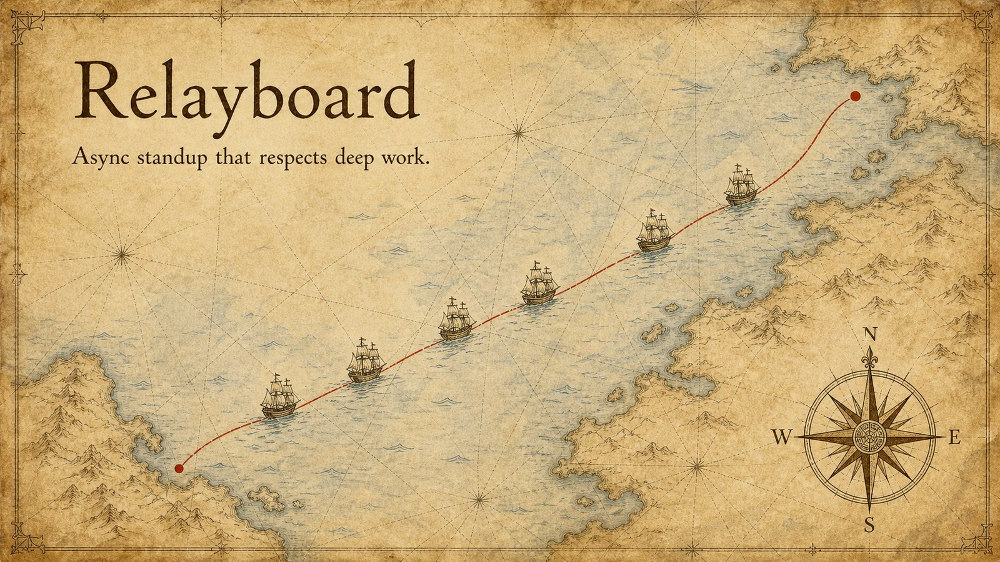
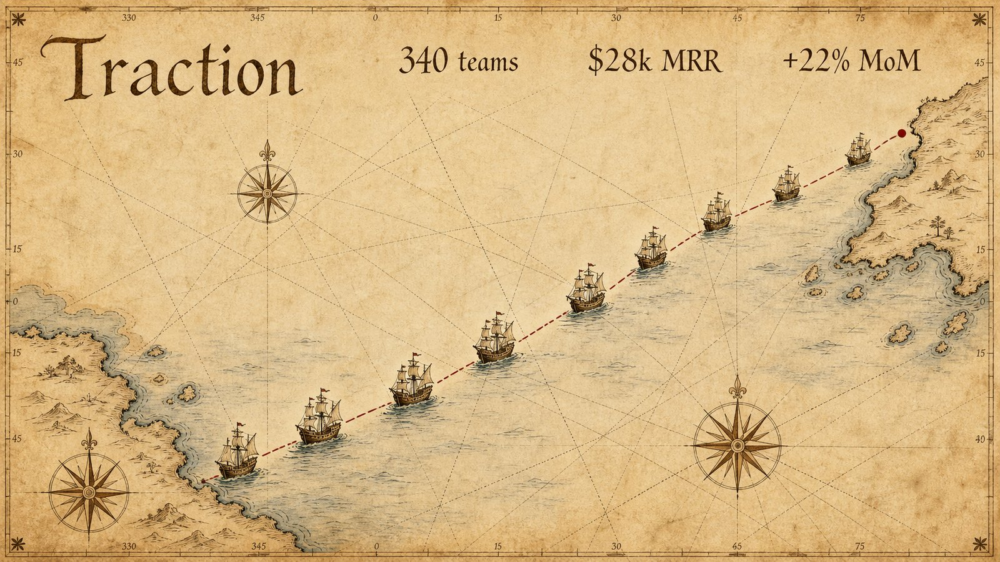

# Relayboard — the Portolan edition

The **same ten pages** as [`../relayboard/`](../relayboard/) — same plan, same densities, same
text — rendered in the **Portolan sea-chart** material instead of dark editorial. The growth
story becomes a voyage: the fleet departs, a route snaps, three islands, three ships of
ascending size, a red route to the sunrise.

<p align="center">
  
  
</p>

That swap is the whole product: **the judgment didn't change, the world did.**
The per-page judgment log lives in the dark edition's [README](../relayboard/README.md);
only the device translations differ (hourglass → navigator's dividers, quadrant → chart
quadrant, timeline → a coastline with harbors).

> Relayboard is fictional; every metric is invented demo content.

## Reproduce it

```bash
cp ../../.env.example .env      # your image-model key
python3 gen.py                  # 10 pages -> slides/
python3 ../../scripts/assemble_pptx.py slides deck.pptx
```
