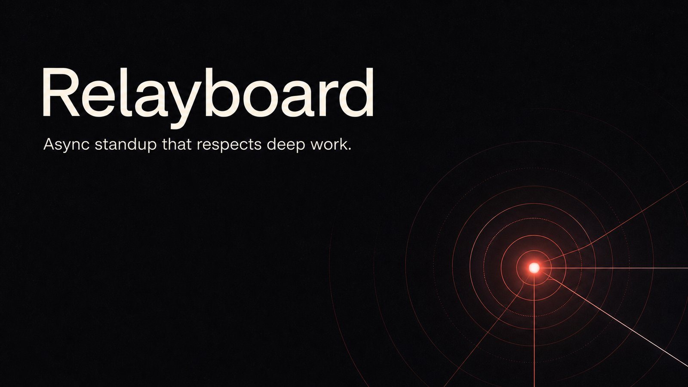
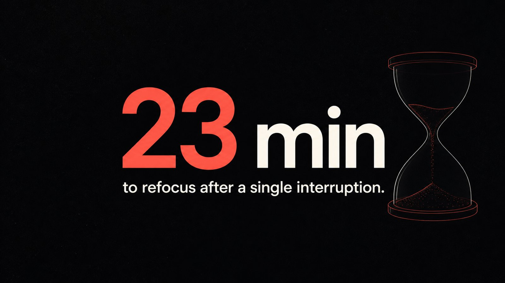
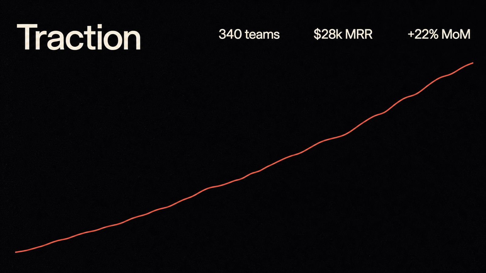
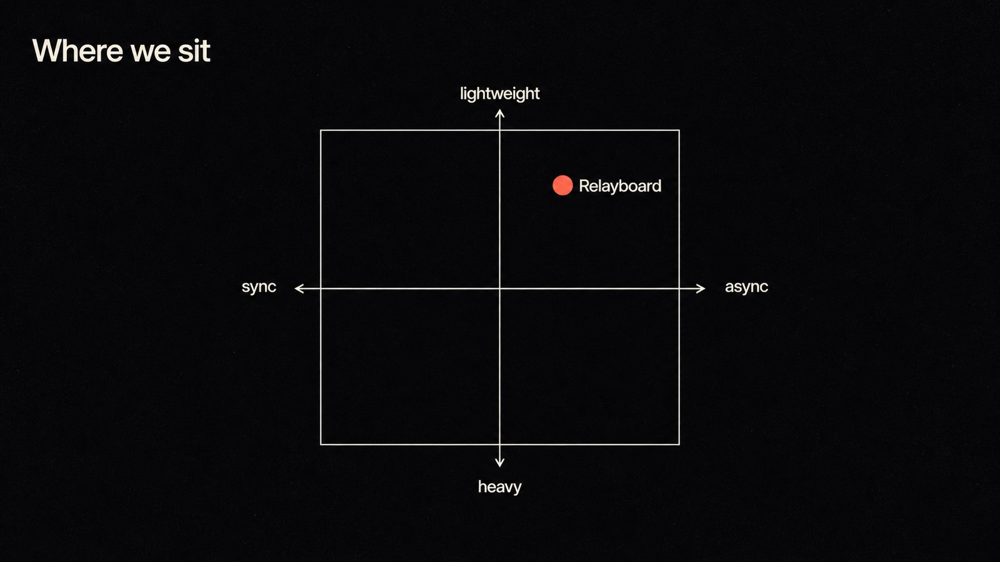

# Relayboard — a worked example

**One sentence in:** *"Make me a 10-page pitch deck for Relayboard, an async-standup tool, in one premium dark-editorial material."*

**Out:** the ten slides in [`slides/`](slides/), assembled into [`deck.pptx`](deck.pptx) (image-based — text isn't editable afterwards).

> **Relayboard is fictional, and every metric on these slides (340 teams, $28k MRR, the prices, the ask) is invented demo content** — this example only demonstrates form. In real use the skill's hard rule applies: it decides the FORM and never invents FACTS; numbers come from your input or become `[TO CONFIRM]` placeholders (see SKILL.md §5).

<p align="center">
  
  
  
  
</p>

This file is the **judgment log** — the part you can't screenshot. In PPT-Zen the *material* is chosen once for the whole deck; *density* and *device* are decided per page. Below is exactly what was decided and why.

**Material (chosen once, whole deck):** near-black `#0e0e12` ground · warm off-white type · one coral `#ff5a4d` accent · fine film grain · generous negative space · one thin line-art device per page. Nothing else changes across the ten pages — that constancy is the deck's identity.

| # | Page | Density call — *why* | Device | On-screen text |
|---|------|----------------------|--------|----------------|
| 01 | cover | **headline** — a name is sayable in a line | signal node, concentric rings | `Relayboard` / *Async standup that respects deep work.* |
| 02 | problem | **headline** — one claim | a focus line that shatters at one point | *Standups interrupt the people doing the work.* |
| 03 | cost | **headline** — one number | giant numeral + draining hourglass | `23 min` / *to refocus after a single interruption.* |
| 04 | product | **headline** — one promise | a tile catching an incoming signal | *The standup comes to you.* |
| 05 | how | **detail** — three steps only mean something side by side | three connected nodes | `How it works` · 1 Post async · 2 Blockers surface · 3 Only who's needed syncs |
| 06 | traction | **detail** — three metrics read together | a steadily rising line | `Traction` · 340 teams · $28k MRR · +22% MoM |
| 07 | pricing | **detail** — tiers exist to be compared | three ascending blocks | `Pricing` · Free · Team $6/seat · Scale $12/seat |
| 08 | competition | **detail** — a position only means something against the axes | 2×2 quadrant, one coral dot | `Where we sit` · sync↔async · heavy↔lightweight |
| 09 | roadmap | **detail** — a sequence you scan | timeline, three milestone dots | `Roadmap` · Now · Q3 · Q4 |
| 10 | ask | **headline** — one line to land on | an arrow sweeping to a horizon | *Raising $1.5M to give every team its focus back.* |

**The shape is the point.** Pages 1–4 are single-idea (headline). Pages 5–8 are the dense evidence block (detail) — steps, metrics, tiers, a competitive map, things that *only hold up when several items sit side by side*. Page 10 returns to a single line to land on. That **headline → detail → headline** rhythm is the judgment layer at work, not decoration: hearing is linear, seeing is simultaneous, so a claim gets a headline and evidence gets a grid. (Pages 5–9 are deliberately a *run* of DETAIL pages — the block works because each keeps a light treatment: three labels, one line, one 2×2. The rule the skill enforces is to land on a breathing page after a dense block, which page 10 does.)

It also doubles as a text-fidelity check: every number, label, axis and price above is rendered *inside the image* — `23 min`, `$28k MRR`, `+22% MoM`, `$6 / seat`, the quadrant labels — and comes out clean. Full-image slides are not limited to one big word.

## Reproduce it

```bash
cp ../../.env.example .env      # then put your image-model key in .env
python3 gen.py                  # generates slides/01…10 with your image model
python3 ../../scripts/assemble_pptx.py slides deck.pptx
```

`gen.py` holds the exact per-page prompts (material + device + verbatim text + the anti-garble tail). Read it to see how the judgment above becomes ten prompts.
