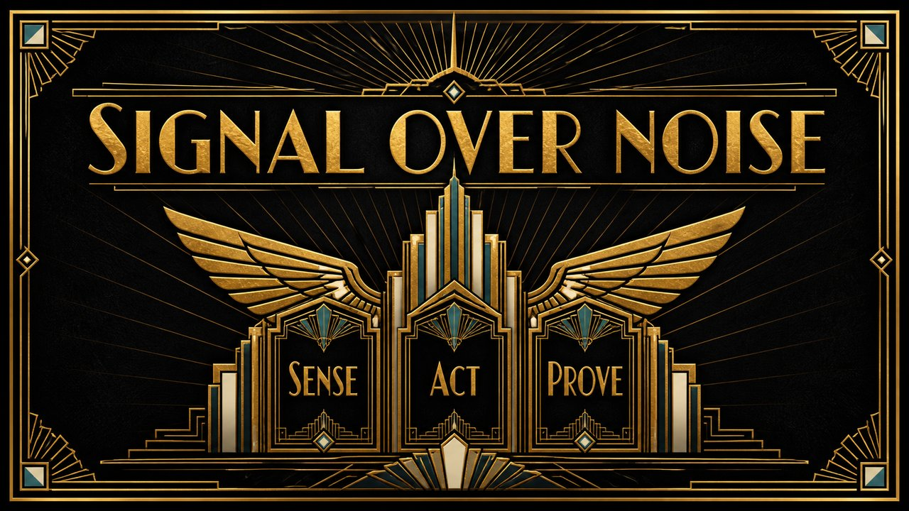

# Art Deco Black & Gold

Geometric Art Deco luxe — black, gold and hard symmetry.

*Swatch shows the same line — `Signal over noise` — rendered in this material, so the surface is the only variable.*

