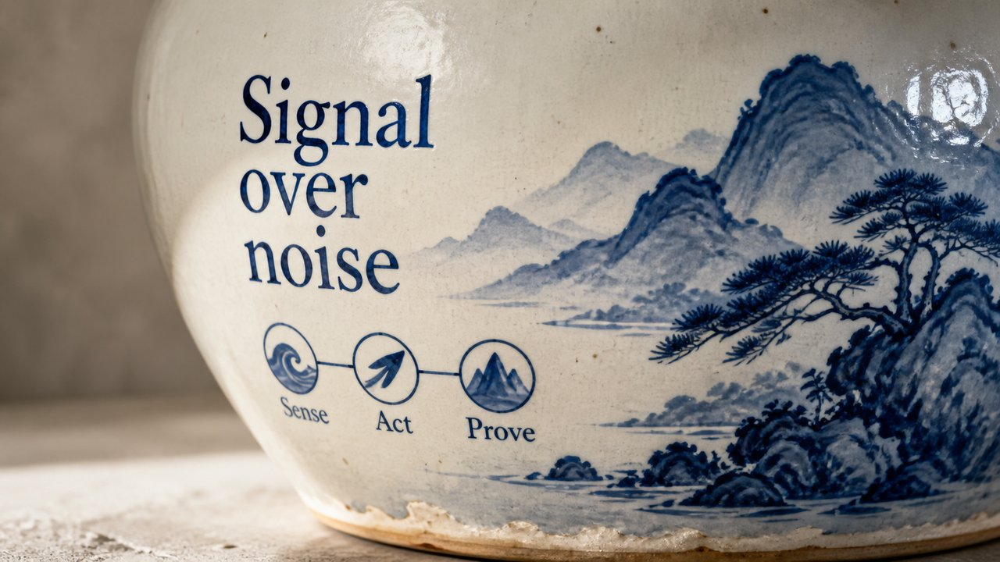

# Blue & White Porcelain

Cobalt under glaze — brushed blue-and-white porcelain painting.

*Swatch shows the same line — `Signal over noise` — rendered in this material, so the surface is the only variable.*

