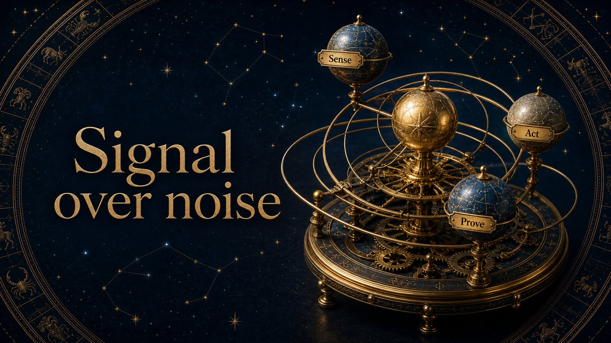

# Celestial Gold

A gilded planetarium plate — deep space, gold constellations on black.

*Swatch shows the same line — `Signal over noise` — rendered in this material, so the surface is the only variable.*

