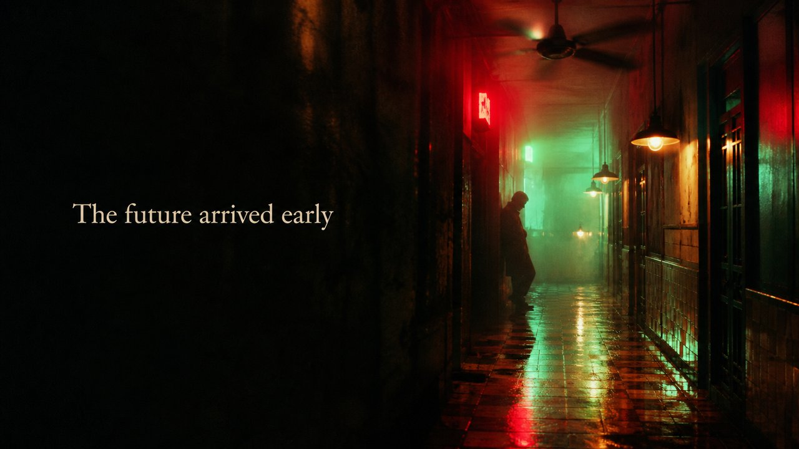

# Neon Nocturne

**Saturated crimson-and-jade neon, smoke and slow motion, romantic melancholy.**

*Same medium (cinema), one director's hand — hold the message fixed, swap the master, and the whole mood turns.*

