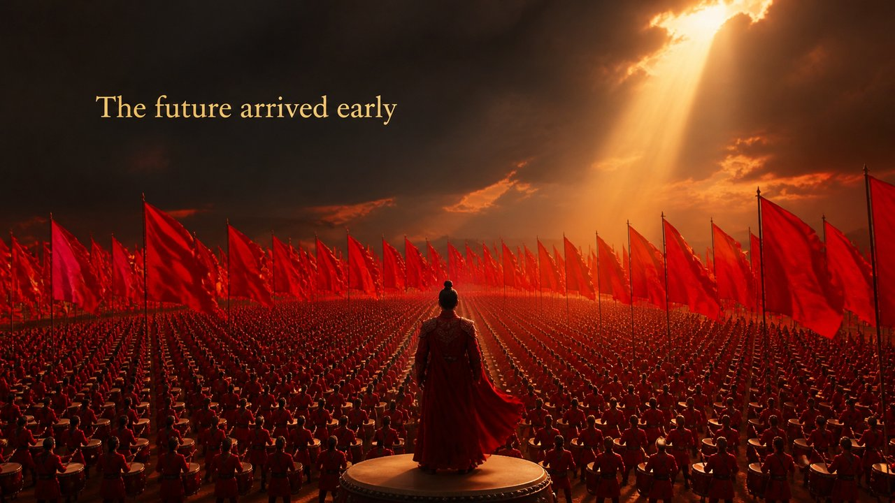

# Cinema · Zhang Yimou hand

**Oceans of one bold color, operatic scale, human mass as pattern.**

*Same medium (cinema), one director's hand — hold the message fixed, swap the master, and the whole mood turns.*

