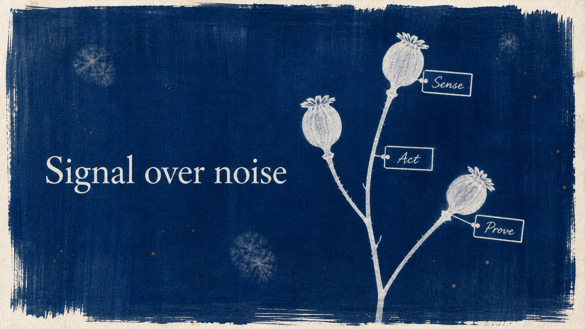

# Cyanotype

A sun-printed cyanotype — prussian blue, ghostly white silhouettes.

*Swatch shows the same line — `Signal over noise` — rendered in this material, so the surface is the only variable.*

