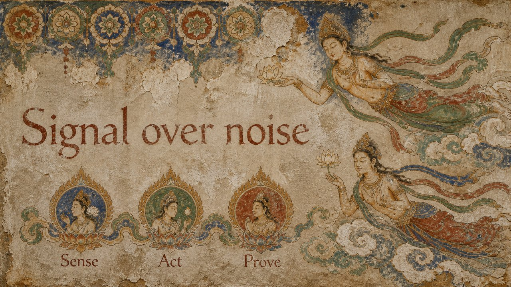

# Dunhuang Mural

A Mogao-cave fresco — mineral pigment, aged wall, flying figures.

*Swatch shows the same line — `Signal over noise` — rendered in this material, so the surface is the only variable.*

