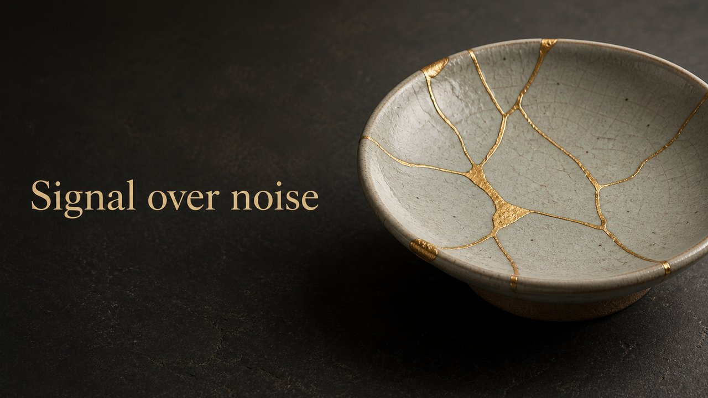

# Kintsugi

Kintsugi — a vessel broken and mended in gold; the break is the point.

*Swatch shows the same line — `Signal over noise` — rendered in this material, so the surface is the only variable.*

