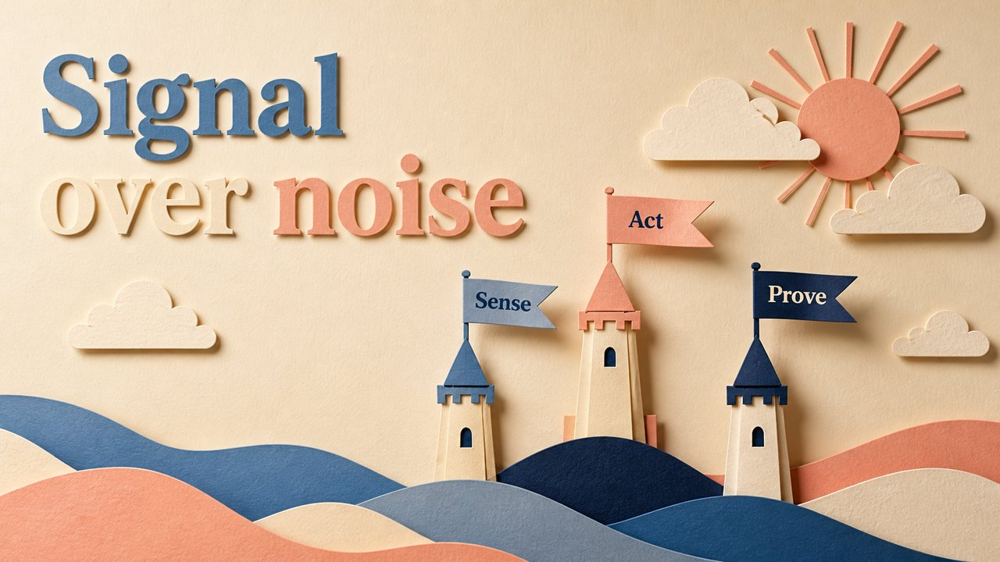

# Paper Sculpture

Layered cut-paper with real drop shadows — tactile, handmade depth.

*Swatch shows the same line — `Signal over noise` — rendered in this material, so the surface is the only variable.*

