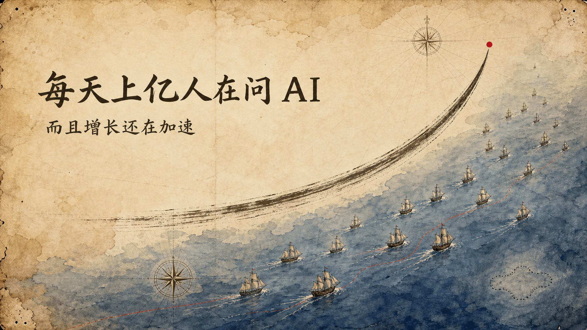

# Portolan Sea Chart · 航海图

**A voyage across an uncharted sea.** Warm, epic, exploratory — turns a "growth / going somewhere new" story into a fleet sailing a rising sea-lane toward a marked destination.

**一片未知海域的航行。** 暖调、史诗、探索感——把"增长 / 走向新大陆"的叙事，画成一支沿着上扬航道驶向标记点的船队。

