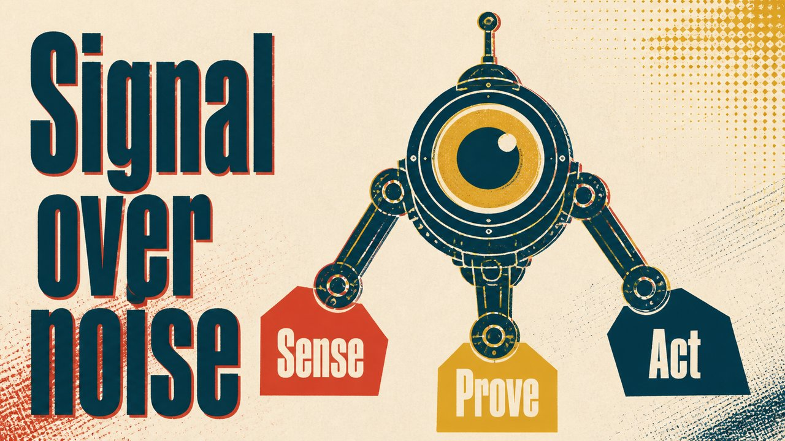

# Screenprint Poster

Bold screenprint spot-inks with a hint of misregister — poster energy.

*Swatch shows the same line — `Signal over noise` — rendered in this material, so the surface is the only variable.*

