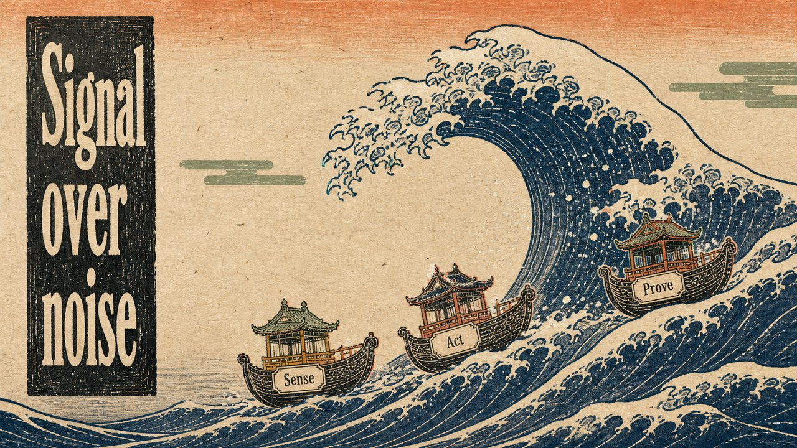

# Ukiyo-e Woodblock

Carved ukiyo-e woodblock — flat inks, keyline, Edo restraint.

*Swatch shows the same line — `Signal over noise` — rendered in this material, so the surface is the only variable.*

