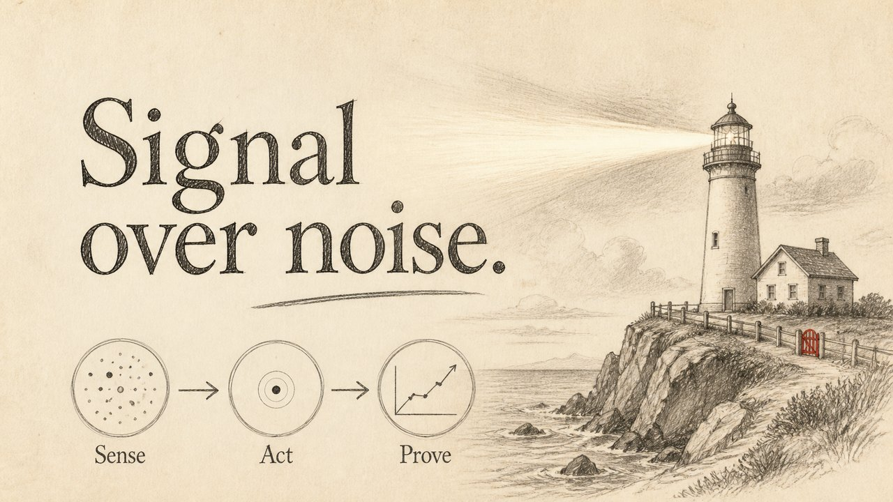

# Warm Pencil Sketch

A warm illustrated notebook page — graphite, sepia, one soft accent.

*Swatch shows the same line — `Signal over noise` — rendered in this material, so the surface is the only variable.*

