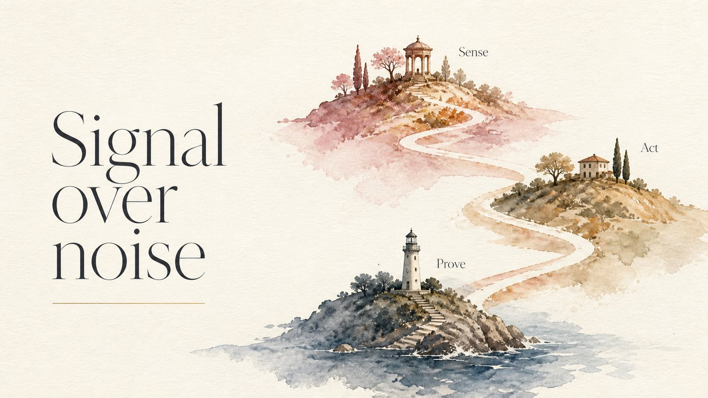

# Watercolor Editorial

Loose watercolor washes — the warmth of a printed magazine spread.

*Swatch shows the same line — `Signal over noise` — rendered in this material, so the surface is the only variable.*

