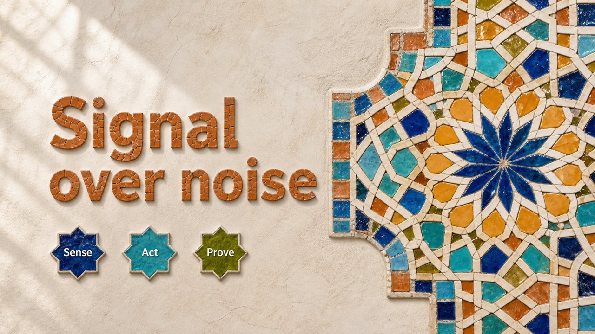

# Zellige Girih

Moroccan zellige — a girih star lattice whose cells hold the content.

*Swatch shows the same line — `Signal over noise` — rendered in this material, so the surface is the only variable.*

